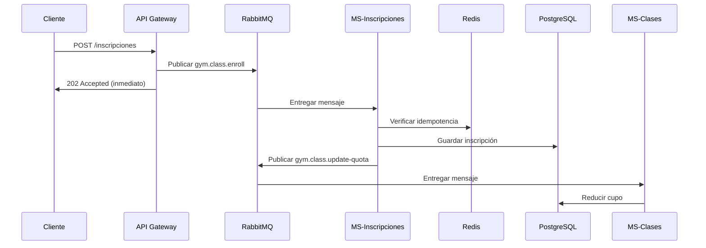

# 🎓 Arquitectura del Sistema - Explicación Detallada

Este documento explica los conceptos arquitectónicos clave implementados en el proyecto.

---

## 📐 1. Arquitectura Híbrida (REST + Mensajería)

### ¿Qué es?

Combina dos paradigmas de comunicación:
- **REST (Síncrono)**: Para entrada de usuarios/clientes
- **Mensajería (Asíncrono)**: Para comunicación interna entre servicios

### ¿Por qué?

| Aspecto | REST | Mensajería |
|---------|------|------------|
| **Simplicidad** | ✅ Fácil para clientes | ⚠️ Más complejo |
| **Desacoplamiento** | ❌ Acoplamiento directo | ✅ Totalmente desacoplado |
| **Resiliencia** | ❌ Si un servicio cae, falla todo | ✅ Colas retienen mensajes |
| **Escalabilidad** | ⚠️ Limitada | ✅ Horizontal fácilmente |
| **Debugging** | ✅ Simple | ⚠️ Requiere herramientas |

### Implementación en el Proyecto

```
Cliente HTTP → API Gateway (REST) → RabbitMQ → Microservicios (Event-Driven)
```

**Ventaja**: El cliente obtiene respuesta rápida (202 Accepted) mientras el procesamiento ocurre en background.

---

## 🚌 2. Event-Driven Architecture (EDA)

### Concepto

Los servicios se comunican mediante **eventos** publicados en un bus de mensajes (RabbitMQ).

### Eventos del Sistema

| Evento | Productor | Consumidor | Propósito |
|--------|-----------|------------|-----------|
| `gym.class.create` | API Gateway | MS-Clases | Crear nueva clase |
| `gym.class.enroll` | API Gateway | MS-Inscripciones | Registrar inscripción |
| `gym.class.update-quota` | MS-Inscripciones | MS-Clases | Reducir cupo disponible |

### Flujo Completo de Inscripción



### Beneficios

- **Desacoplamiento**: MS-Inscripciones no conoce a MS-Clases directamente
- **Extensibilidad**: Agregar consumidores (ej: servicio de notificaciones) sin modificar código
- **Trazabilidad**: Todos los eventos quedan registrados

---

## 🛡️ 3. Idempotent Consumer Pattern

### Problema

En sistemas distribuidos, los mensajes pueden duplicarse por:
- Reintentos automáticos
- Problemas de red
- Fallos parciales

**Riesgo**: Procesar el mismo mensaje 2+ veces → datos duplicados

### Solución: Idempotencia

> **Idempotente**: Operación que produce el mismo resultado sin importar cuántas veces se ejecute

### Implementación

#### Paso 1: Generar `messageId` único

```typescript
// api-gateway/src/shared/rabbitmq.service.ts
const messageId = uuidv4(); // UUID único
const message = {
  messageId,
  data: {...},
  timestamp: new Date().toISOString(),
};
```

#### Paso 2: Verificar antes de procesar

```typescript
// ms-inscripciones/src/shared/idempotency.service.ts
async isProcessed(messageId: string): Promise<boolean> {
  const key = this.PREFIX + messageId;
  const exists = await this.redis.exists(key);
  return exists === 1;
}
```

#### Paso 3: Procesar solo si es nuevo

```typescript
// ms-inscripciones/src/inscripciones/inscripciones.service.ts
async processEnrollmentIdempotent(messageId: string, data: any) {
  const alreadyProcessed = await this.idempotencyService.isProcessed(messageId);
  
  if (alreadyProcessed) {
    // Retornar sin procesar
    return { success: true, duplicate: true };
  }

  // Procesar normalmente
  const inscripcion = await this.create(messageId, data);

  // Marcar como procesado
  await this.idempotencyService.markAsProcessed(messageId);

  return { success: true, duplicate: false };
}
```

#### Paso 4: Almacenar en Redis con TTL

```typescript
async markAsProcessed(messageId: string): Promise<void> {
  const key = this.PREFIX + messageId;
  await this.redis.set(key, JSON.stringify({...}), 'EX', 86400); // 24 horas
}
```

### Doble Protección

1. **Redis**: Verifica rápidamente si fue procesado
2. **Base de Datos**: `message_id` único impide duplicados a nivel SQL

```typescript
@Column({ name: 'message_id', type: 'varchar', unique: true })
messageId: string;
```

### ¿Por qué Redis?

| Alternativa | Pros | Contras |
|-------------|------|---------|
| **Redis** | Rápido, TTL automático | Requiere otro servicio |
| **Base de Datos** | No requiere infra extra | Más lento, requiere limpieza manual |
| **Memoria** | Rapidísimo | Se pierde al reiniciar |

**Decisión**: Redis por balance entre velocidad y persistencia.

---

## 💾 4. Database per Service

### Concepto

Cada microservicio tiene su propia base de datos **independiente**.

### Implementación

```yaml
# docker-compose.yml
postgres-clases:
  environment:
    POSTGRES_DB: gym_clases
  ports:
    - "5432:5432"

postgres-inscripciones:
  environment:
    POSTGRES_DB: gym_inscripciones
  ports:
    - "5433:5432"  # Puerto diferente externamente
```

### Esquemas

**MS-Clases**:
```sql
CREATE TABLE clases (
  id SERIAL PRIMARY KEY,
  nombre VARCHAR(255),
  horario VARCHAR(100),
  cupo INTEGER,
  instructor VARCHAR(255)
);
```

**MS-Inscripciones**:
```sql
CREATE TABLE inscripciones (
  id SERIAL PRIMARY KEY,
  clase_id INTEGER,        -- NO es FK, solo referencia
  alumno VARCHAR(255),
  email VARCHAR(255),
  message_id VARCHAR(255) UNIQUE
);
```

### ⚠️ Importante

- `clase_id` NO es Foreign Key
- No hay queries JOIN entre servicios
- Consistencia eventual vía eventos

### Consistencia Eventual

```
T0: Crear inscripción (cupo = 20 en MS-Clases)
T1: Inscripción guardada (MS-Inscripciones)
T2: Evento publicado (gym.class.update-quota)
T3: Cupo actualizado (cupo = 19 en MS-Clases)
```

**Ventana de inconsistencia**: T1 → T3 (milisegundos/segundos)

---

## 🔧 5. Configuración de RabbitMQ

### Exchange Type: Topic

```typescript
await channel.assertExchange('gym.exchange', 'topic', { durable: true });
```

**Topic**: Permite routing flexible con patrones.

### Queues

```typescript
await channel.assertQueue('gym.class.create', { durable: true });
await channel.assertQueue('gym.class.enroll', { durable: true });
await channel.assertQueue('gym.class.update-quota', { durable: true });
```

**Durable**: Sobreviven a reinicios de RabbitMQ.

### Bindings

```typescript
await channel.bindQueue('gym.class.create', 'gym.exchange', 'gym.class.create');
```

**Routing Key**: Determina a qué cola va el mensaje.

### Prefetch Count

```typescript
// ms-inscripciones/src/main.ts
prefetchCount: 1
```

**Propósito**: Procesar un mensaje a la vez para garantizar orden y consistencia.

---

## 🎯 6. API Gateway Pattern

### Responsabilidades

1. ✅ **Punto de entrada único**
2. ✅ **Validación de DTOs**
3. ✅ **Publicación de eventos**
4. ✅ **Respuesta rápida al cliente**
5. ❌ **SIN lógica de negocio**

### Ejemplo: ClasesController

```typescript
@Post()
@HttpCode(HttpStatus.ACCEPTED) // 202, no 201
async create(@Body() createClaseDto: CreateClaseDto) {
  const result = await this.rabbitMQService.publishEvent(
    'gym.class.create',
    createClaseDto,
  );

  return {
    message: 'Clase creation request received',
    ...result,
  };
}
```

**Clave**: Retorna inmediatamente después de publicar evento.

---

## 📊 7. Monitoreo y Observabilidad

### RabbitMQ Management UI

http://localhost:15672

**Métricas**:
- Mensajes en cola
- Tasa de publicación/consumo
- Conexiones activas

### Logs Estructurados

```typescript
this.logger.log(`✅ Message ${messageId} processed successfully`);
this.logger.warn(`⚠️ Duplicate message: ${messageId}`);
this.logger.error(`❌ Error: ${error.message}`);
```

**Beneficio**: Fácil búsqueda con `docker logs | grep "messageId"`

### Redis CLI

```bash
docker exec -it redis redis-cli

> KEYS idempotent:*
> GET idempotent:uuid-123
> TTL idempotent:uuid-123
```

---

## 🔬 8. Casos de Uso Reales

### Caso 1: Cupo Lleno

1. Cliente intenta inscribirse
2. MS-Inscripciones verifica cupo (via query directa o caché)
3. Si cupo = 0 → Rechaza
4. Si cupo > 0 → Procesa

**Mejora futura**: Implementar validación antes de guardar.

### Caso 2: Servicio MS-Clases Caído

1. Cliente crea inscripción
2. Evento `gym.class.update-quota` queda en cola
3. MS-Clases está caído → mensaje no se consume
4. MS-Clases se recupera → procesa mensajes pendientes

**Ventaja**: No se pierde ningún mensaje.

### Caso 3: Redis Caído

1. MS-Inscripciones no puede verificar idempotencia
2. **Fallback**: Constraint unique en BD evita duplicados
3. Logs muestran error de Redis pero sistema sigue operando

**Resiliencia**: Doble protección.

---

## 📚 Referencias Adicionales

- [Microservices Patterns - Chris Richardson](https://microservices.io)
- [NestJS Microservices](https://docs.nestjs.com/microservices/basics)
- [RabbitMQ Tutorials](https://www.rabbitmq.com/getstarted.html)
- [Redis Documentation](https://redis.io/documentation)
- [CAP Theorem](https://en.wikipedia.org/wiki/CAP_theorem)

---

**Pregunta**: ¿Cómo escalaríamos este sistema para 10,000 usuarios concurrentes?

**Respuesta**:
1. Múltiples instancias de cada MS (horizontal scaling)
2. Load balancer delante del API Gateway
3. Redis Cluster para alta disponibilidad
4. RabbitMQ Cluster
5. PostgreSQL con read replicas
6. Implementar caché (ej: cupos disponibles)
